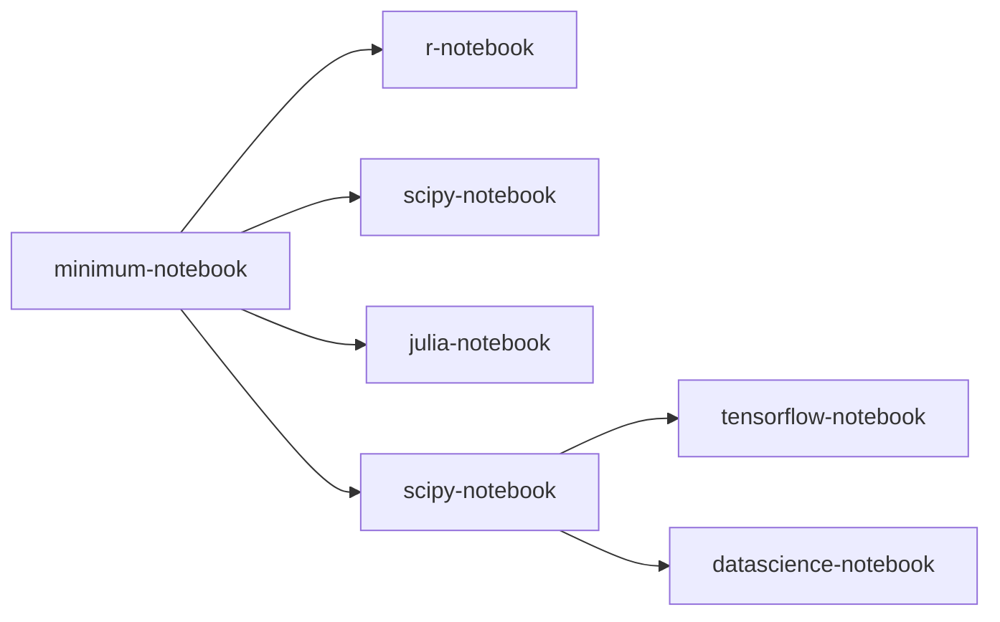
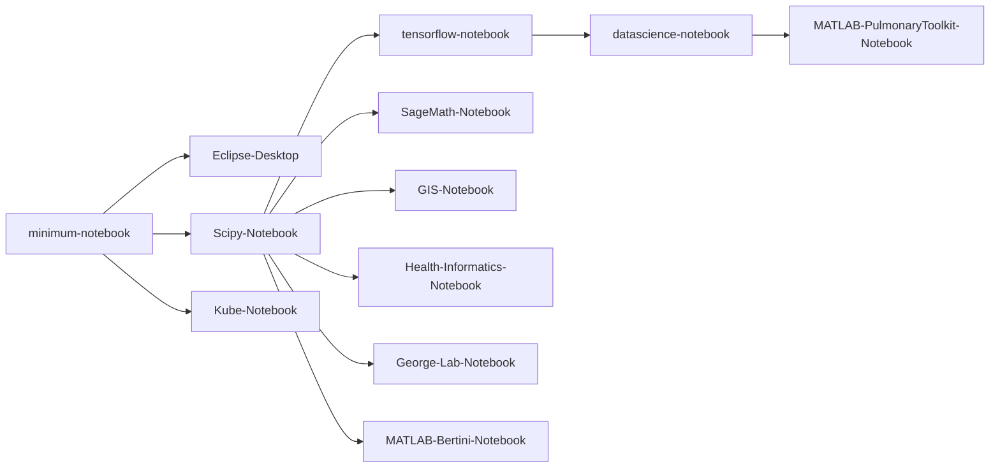

# Available Container Images

JupyerHub makes use of a container image to execute your code/commands. You must use a container image that contains the software you wish to use. We use [images](https://ucsd-prp.gitlab.io/userdocs/running/sci-img/){:target="_blank"} provided by Nautilus which are based on [Jupyter Docker Stacks](https://jupyter-docker-stacks.readthedocs.io/en/latest/using/selecting.html#core-stacks){:target="_blank"}. However, additional images can be created for specific needs.

All images include GPU Nvidia and CUDA support, and will provide access to GPU resources if selected during container launch.

{: .note }
Some container images have been discontinued, see [discontinued container images](#discontinued-container-images) for alternatives.

## General Container Images

The following general purpose containers are available for use.

| Name                               | Image               | Software             | JupyterHub Instance             |
|:-----------------------------------|:--------------------|:---------------------|:--------------------------------|
| Jupyter Stack Minimal Notebook     | [minimal-notebook](https://github.com/jupyter/docker-stacks/tree/main/images/minimal-notebook){:target="_blank"} | Ubuntu 22.04.4 JupyterLab 4.2.4 Python 3.11.9 Git 2.34.1 vi nano wget unzip tzdata | SDSU, CSU TIDE, Instruction |
| Jupyter Stack R Notebook           | [r-notebook](https://github.com/jupyter/docker-stacks/tree/main/images/r-notebook){:target="_blank"} | (Everything in jupyter/minimal-notebook) The R interpreter and base environment IRKernel to support R code in Jupyter notebooks tidyverse packages from [conda-forge](https://conda-forge.org/feedstock-outputs/index.html){:target="_blank"} [caret](https://topepo.github.io/caret/index.html){:target="_blank"}, [crayon](https://cran.r-project.org/web/packages/crayon/index.html){:target="_blank"}, [devtools](https://cran.r-project.org/web/packages/devtools/index.html){:target="_blank"}, [forecast](https://cran.r-project.org/web/packages/forecast/index.html){:target="_blank"}, [hexbin](https://cran.r-project.org/web/packages/hexbin/index.html){:target="_blank"}, [htmltools](https://cran.r-project.org/web/packages/htmltools/index.html){:target="_blank"}, [htmlwidgets](https://www.htmlwidgets.org/){:target="_blank"}, [nycflights13](https://cran.r-project.org/web/packages/nycflights13/index.html){:target="_blank"}, [randomforest](https://cran.r-project.org/web/packages/randomForest/index.html){:target="_blank"}, [rcurl](https://cran.r-project.org/web/packages/RCurl/index.html){:target="_blank"}, [rmarkdown](https://rmarkdown.rstudio.com/){:target="_blank"}, [rodbc](https://cran.r-project.org/web/packages/RODBC/index.html){:target="_blank"}, [rsqlite](https://cran.r-project.org/web/packages/RSQLite/index.html){:target="_blank"}, [shiny](https://shiny.rstudio.com/){:target="_blank"}, [tidymodels](https://www.tidymodels.org/){:target="_blank"}, [unixodbc](http://www.unixodbc.org/){:target="_blank"} packages from [conda-forge](https://conda-forge.org/feedstock-outputs/index.html){:target="_blank"} | SDSU, CSU TIDE, Instruction |
| Jupyter Stack SciPy Notebook       | [scipy-notebook](https://github.com/jupyter/docker-stacks/tree/main/images/scipy-notebook){:target="_blank"} | (Everything in jupyter/minimal-notebook) [altair](https://altair-viz.github.io/){:target="_blank"}, [beautifulsoup4](https://www.crummy.com/software/BeautifulSoup/){:target="_blank"}, [bokeh](https://docs.bokeh.org/en/latest/){:target="_blank"}, [bottleneck](https://bottleneck.readthedocs.io/en/latest/){:target="_blank"}, [cloudpickle](https://github.com/cloudpipe/cloudpickle){:target="_blank"}, [conda-forge::blas=*=openblas](https://www.openblas.net/){:target="_blank"}, [cython](https://cython.org/){:target="_blank"}, [dask](https://www.dask.org/){:target="_blank"}, [dill](https://pypi.org/project/dill/){:target="_blank"}, [h5py](https://www.h5py.org/){:target="_blank"}, [matplotlib-base](https://matplotlib.org/){:target="_blank"}, [numba](https://numba.pydata.org/){:target="_blank"}, [numexpr](https://github.com/pydata/numexpr){:target="_blank"}, [openpyxl](https://openpyxl.readthedocs.io/en/stable/){:target="_blank"}, [pandas](https://pandas.pydata.org/){:target="_blank"}, [patsy](https://patsy.readthedocs.io/en/latest/){:target="_blank"}, [protobuf](https://developers.google.com/protocol-buffers/docs/pythontutorial){:target="_blank"}, [pytables](https://www.pytables.org/){:target="_blank"}, [scikit-image](https://scikit-image.org/){:target="_blank"}, [scikit-learn](https://scikit-learn.org/stable/){:target="_blank"}, [scipy](https://scipy.org/){:target="_blank"}, [seaborn](https://seaborn.pydata.org/){:target="_blank"}, [sqlalchemy](https://www.sqlalchemy.org/){:target="_blank"}{:target="_blank"}, [statsmodel](https://www.statsmodels.org/stable/index.html){:target="_blank"}, [sympy](https://www.sympy.org/en/index.html){:target="_blank"}, [widgetsnbextension](https://ipywidgets.readthedocs.io/en/latest/user_install.html#installing-in-classic-jupyter-notebook){:target="_blank"}, [xlrd](https://www.python-excel.org/){:target="_blank"} packages ipympl and ipywidgets for interactive visualizations and plots in Python notebooks [Facets](https://github.com/PAIR-code/facets){:target="_blank"} for visualizing machine learning datasets | SDSU, CSU TIDE, Instruction |
| Jupyter Stack Tensorflow Notebook  | [tensorflow-notebook](https://github.com/jupyter/docker-stacks/tree/main/images/tensorflow-notebook){:target="_blank"} | (Everything in jupyter/scipy-notebook and its ancestor images) [tensorflow](https://www.tensorflow.org/){:target="_blank"} machine learning library Jupyter Server Proxy to support TensorBoard | SDSU, CSU TIDE, Instruction |
| Jupyter Stack PyTorch Notebook     | [pytorch-notebook](https://github.com/jupyter/docker-stacks/tree/main/images/pytorch-notebook){:target="_blank"} | (Everything in jupyter/scipy-notebook and its ancestor images) [pytorch](https://pytorch.org/){:target="_blank"} machine learning library (torch, torchaudio, torchvision) | SDSU, CSU TIDE, Instruction | 
| Jupyter Stack Julia Notebook       | [julia-notebook](https://github.com/jupyter/docker-stacks/tree/main/images/julia-notebook){:target="_blank"} | (Everything in jupyter/minimal-notebook) The [Julia](https://julialang.org/){:target="_blank"} compiler and base environment [IJulia](https://julialang.github.io/IJulia.jl/stable/){:target="_blank"} to support Julia code in Jupyter notebook [Pluto.jl](https://plutojl.org/){:target="_blank"} reactive Julia notebook interface, made accessible with [jupyter-pluto-proxy](https://pypi.org/project/jupyter-pluto-proxy/){:target="_blank"} [HDF5](https://docs.h5py.org/en/stable/){:target="_blank"} package | TIDE, SDSU, Instruction
| Jupyter Stack Datascience Notebook | [datascience-notebook](https://github.com/jupyter/docker-stacks/tree/main/images/datascience-notebook){:target="_blank"} | (Everything in the jupyter/scipy-notebook, jupyter/r-notebook, and jupyter/julia-notebook images and their ancestor images) [rpy2](https://rpy2.github.io/doc/latest/html/index.html){:target="_blank"} package | SDSU, CSU TIDE |

The following diagram shows the relationship of the above container images.

## Custom Container Images

| Name                        | Image               | Software             | JupyterHub Instance             |
|:----------------------------|:--------------------|:---------------------|:--------------------------------|
| NRP R Studio Notebook       | [r-studio](https://gitlab.nrp-nautilus.io/nrp/scientific-images/rstudio){:target="_blank"} | (Everything in jupyter/r-notebook and its ancestors) R Studio | SDSU, CSU TIDE, Instruction |
| Eclipse C/C++ Desktop       | [eclipse-notebook](https://github.com/SDSU-Research-CI/eclipse-notebook){:target="_blank"} | (Everything in jupyter/minimal-notebook) Eclipse IDE for C/C++ Developers 2024-06 release for Linux x86_64 __build-essential__ __Jupyter Desktop Proxy__ [xfce4](https://www.xfce.org/about){:target="_blank"} desktop | SDSU, CSU TIDE, Instruction |
| Kube Notebook               | [kube-notebook](https://github.com/SDSU-Research-CI/kube-notebook){:target="_blank"} | (Everything in jupyter/minimal-notebook) [rclone](https://rclone.org/){:target="_blank"} [kubectl](https://kubernetes.io/docs/reference/kubectl/){:target="_blank"} __Jupyter Desktop__ __Code Server (VS Code)__ __Globus Connect Personal__ __NB Conda Kernels__ | SDSU, CSU TIDE, Instruction |
| SageMath Notebook           | [sagemath-notebook](https://github.com/SDSU-Research-CI/sagemath-notebook){:target="_blank"} | (Everything in jupyter/scipy-noteboo and its ancestors) [SageMath Kernel](https://doc.sagemath.org/html/en/index.html#){:target="_blank"} | SDSU, CSU TIDE, Instruction |
| GIS Notebook                | [gis-notebook](https://github.com/SDSU-Research-CI/gis-notebook){:target="_blank"} | (Everything in jupyter/pytorch-notebook and its ancestors) [beautifulsoup4](https://pypi.org/project/beautifulsoup4/){:target="_blank"} __boto3__ __eo-learn__ [geopandas](https://geopandas.org/en/stable/docs/user_guide.html){:target="_blank"} [geoplot](https://pypi.org/project/geoplot/){:target="_blank"} [laspy](https://laspy.readthedocs.io/en/latest/){:target="_blank"} __lightgbm__ __natsort__ [netcdf4](https://pypi.org/project/netCDF4/){:target="_blank"} [networkx](https://networkx.org/){:target="_blank"} [psycopg2](https://pypi.org/project/psycopg2/){:target="_blank"} [pysal](https://pysal.org/){:target="_blank"} [rasterio](https://rasterio.readthedocs.io/en/stable/){:target="_blank"} [rclone](https://rclone.org/){:target="_blank"} [selenium](https://www.selenium.dev/){:target="_blank"} __sentinelhub__ __xeus-python__ | SDSU, CSU TIDE, Instruction |
| Health-Informatics-Notebook | [health-informatics-notebook](https://github.com/SDSU-Research-CI/health-informatics-notebook){:target="_blank"} | (Everything in jupyter/scipy-notebook and its ancestors) __bcftools__ [biopython](https://biopython.org/wiki/Documentation){:target="_blank"} __bwa__ __ensembl-vep__ __fastp__ __goalign__ __gotree__ __mafft__ __modeltest-ng__ __mummer__ [pytest](https://docs.pytest.org/en/7.4.x/){:target="_blank"} __raxml-ng__ __samtools__ __spades__ __varscan__  | SDSU, CSU TIDE, Instruction |
| Astro Notebook              | [astro-notebook](https://github.com/SDSU-Research-CI/astro-notebook){:target="_blank"} | (Everything in jupyter/scipy-notebook and its ancestors) __astropy__ __astroquery__ __bcftools__ __biopython__ __bwa__ __corner__ __ensembl-vep__ __emcee__ __fastp__ __fsps__ __goalign__ __gotree__ __lxml__ __mafft__ __modeltest-ng__ __mummer__ __photutils__ __PTS__ __pytest__ __raxml-ng__ __reportlab__ __samtools__ __SKIRT__ __spades__ __varscan__ | SDSU, CSU TIDE, Instruction
| LLM Notebook                | [llm-notebook](https://github.com/SDSU-Research-CI/LLM-Notebook){:target="_blank"} | (Everything in jupyter/pytorch-notebook and its ancestors) __accelerate__ __auto_gptq__ __autoawq__ __bcftools__ __biopython__ __bitsandbytes__ __bwa__ __chromadb__ __Code Server (VS Code)__ __corner__ __cuda-nvcc__ __dask-kubernetes__ __deepspeed__ __ensembl-vep__ __emcee__ __FastChat__ __fastp__ __fsps__ __goalign__ __gotree__ __huggingface_hub__ __Jupyter AI__ __langchain__ __lxml__ __mafft__ __modeltest-ng__ __mummer__ __ollama-python__ __Ollama__ __openai__ __pyaudio__ __peft__ __photutils__ __portaudio__ __PTS__ __pytest__ __raxml-ng__ __rclone__ __reportlab__ __samtools__ __SKIRT__ __spades__ __transformers__ __trl__ __varscan__ __xformers__ | SDSU, CSU TIDE, Instruction
| George Lab Notebook         | [georgelab-notebook](https://github.com/SDSU-Research-CI/georgelab-notebook){:target="_blank"} | (Everything in jupyter/scipy-notebook and its ancestors) __accelerate__ __auto_gptq__ __autoawq__ __bcftools__ __biopython__ __bitsandbytes__ __bwa__ __chromadb__ __Code Server (VS Code)__ __corner__ __cuda-nvcc__ __dask-kubernetes__ __deepspeed__ __ensembl-vep__ __emcee__ __FastChat__ __fastp__ __fsps__ __goalign__ __gotree__ [gudhi](https://github.com/GUDHI){:target="_blank"} __huggingface_hub__ __Jupyter AI__ __langchain__ __lxml__ __mafft__ __modeltest-ng__ __mummer__ __nb_conda_kernels__ __ollama-python__ __Ollama__ [opencv](https://github.com/opencv/opencv){:target="_blank"} __openai__ __peft__ [persim](https://persim.scikit-tda.org/en/latest/){:target="_blank"} __photutils__ __portaudio__ __pyaudio__ __PTS__ __pytest__ __raxml-ng__ __rclone__ __reportlab__ [ripser](https://ripser.scikit-tda.org/en/latest/){:target="_blank"} __samtools__ __SKIRT__ __spades__ [tabulate](https://pypi.org/project/tabulate/){:target="_blank"} __tissue-forge (CPU and GPU)__ __transformers__ __trl__ __varscan__ __VS Code Server__ __xformers__ | SDSU |
| MATLAB + Pulmonary Toolkit  | Image is available upon request | (Everything in jupyter/scipy-notebook and its ancestors) __MATLAB r2024b__ [MATLAB pulmonarytoolkit](https://github.com/tomdoel/pulmonarytoolkit.git){:target="_blank"} [rclone](https://rclone.org/install/) [NBIA Data Retriever](https://wiki.nci.nih.gov/display/NBIA/Downloading+NBIA+Images+6.5.3) [Jupyter Desktop](https://github.com/jupyterlab/jupyterlab-desktop) | SDSU |
| MATLAB + Bertini            | Image is available upon request | (Everything in jupyter/datascience-notebook) __Bertini__ __LikelihoodProfiler__ __MATLAB r2024b__ [PyTorch](https://pytorch.org/get-started/locally/) __StructuralIdentifiability__ | SDSU |
| Kaya Lab Notebook           | [kaya-notebook](https://github.com/SDSU-Research-CI/kaya-notebook){:target="_blank"} | (Everything in jupyter/minimal-notebook) [Code Server (VS Code)](https://code.visualstudio.com/docs/remote/vscode-server){:target="_blank"} __torch_amr__ environment | SDSU |
| MESA Notebook               | [mesa-notebook](https://github.com/SDSU-Research-CI/mesa-notebook){:target="_blank"} | (Everything in jupyter/minimal-notebook) __binutils__ __libx11-6__ __libx11-dev__ __make__ __mesa-r24.03.1__ __tcsh__ __unzip__ __zlib1g__ __zlib1g-dev__ | SDSU | 
| PyTorch Geometric Notebook  | [torch-geometric-notebook](https://github.com/SDSU-Research-CI/torch-geometric-notebook){:target="_blank"} | (Everything in jupyter/pytorch-notebook and its ancestors) __Code Server (VS Code)__ __PyTorch Geometric__ __rclone__ | SDSU |
| FST3 Notebook               | [fst3-notebook](https://github.com/SDSU-Research-CI/FST3-Notebook){:target="_blank"} | (Everything in jupyter/minimal-notebook) __TODO__ | SDSU | 
| ClimaAtmos Notebook         | __link dead in sheet__ | (Everything in jupyter/julia-notebook and its ancestors) __ClimaAtmos__ __ClimaCore__ __ClimaCoupler__ __cuda-runtime__ __openmpi__ | SDSU |
| RStudio Desktop Notebook    | [rstudio-desktop-notebook](https://github.com/SDSU-Research-CI/rstudio-desktop-notebook){:target="_blank"} | (Everything in NRP R Studio Notebook) __RStudio__ __Jupyter Desktop__ | SDSU | 
| Modular Dynamics Notebook   | [modular-dynamics-notebook](https://github.com/SDSU-Research-CI/md-notebook){:target="_blank"} | (Everything in jupyter/scipy-notebook and its ancestors) __LAMMPS__ __Jupyter Desktop__ __Quantum Espresso__ __cmake__ __gcc__ __g++__ __openmpi-bin__ __ovito__ __vim__ | SDSU, Instruction |
| TEND Lab Notebook           | [tend-lab-notebook](https://github.com/SDSU-Research-CI/tend-lab-notebook){:target="_blank"} | (Everything in jupyter/r-notebook) __AFNI__ __Jupyter Desktop__ __Rclone__ __SUMA__ __TEND Lab conda environment__ __VS Code__ | SDSU |
| BART Notebook               | [bart-notebook](https://github.com/SDSU-Research-CI/BART-Notebook){:target="_blank"} | (Everything in jupyter/scipy-notebook) __BART__ __Code Server (VS Code)__ __Globus Connect Personal__ __Jupyter Desktop__ __NB Conda Kernels__ __rclone__ __Custom environment__  | SDSU | 

The following diagram shows the relationship between the general and custom container images.

## Discontinued Container Images

| Name      | Alternative |
|:----------|:------------|
| Stack PRP | Jupyter Stack PyTorch Notebook in [general container images](#general-container-images)
