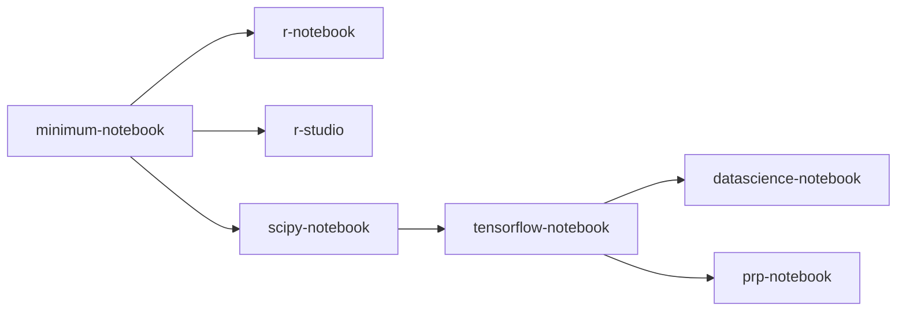

{: .note }
This page is currently under construction. Information will be updated soon.

# Available Container Images

JupyerHub makes use of a container image to execute your code/commands. You must use a container image that contains the software you wish to use. We use [images](https://ucsd-prp.gitlab.io/userdocs/running/sci-img/){:target="_blank"} provided by Nautilus which are based on [Jupyter Docker Stacks](https://jupyter-docker-stacks.readthedocs.io/en/latest/using/selecting.html#core-stacks){:target="_blank"}. However, additional images can be created for specific needs.

All images include GPU Nvidia and CUDA support, and will provide access to GPU resources if selected during container launch.

## General Container Images

The following general purpose containers are available for use.

| Name                  | Image               | Software             | Campus             |
|:----------------------|:--------------------|:---------------------|:-------------------|
| Stack Minimal         | [minimal-notebook](https://gitlab.nrp-nautilus.io/prp/jupyter-stack/-/tree/prp/minimal-notebook){:target="_blank"} | Ubuntu 20.04 JupyterLab 4.0.2 Python 3.10.12 Git 2.25.1 Cuda 11.7.r11.7 vi nano tzdata unzip | SDSU |
| Stack R               | [r-notebook](https://gitlab.nrp-nautilus.io/prp/jupyter-stack/-/tree/prp/r-notebook){:target="_blank"} | (everything in minimal-notebook) R 4.3.1 IRKernel to support R code in Jupyter notebooks [tidyverse](https://www.tidyverse.org/){:target="_blank"} packages 2.0.0 [caret](https://topepo.github.io/caret/index.html){:target="_blank"}, [crayon](https://cran.r-project.org/web/packages/crayon/index.html){:target="_blank"}, [devtools](https://cran.r-project.org/web/packages/devtools/index.html){:target="_blank"}, [forecast](https://cran.r-project.org/web/packages/forecast/index.html){:target="_blank"}, [hexbin](https://cran.r-project.org/web/packages/hexbin/index.html){:target="_blank"}, [htmltools](https://cran.r-project.org/web/packages/htmltools/index.html){:target="_blank"}, [htmlwidgets](https://www.htmlwidgets.org/){:target="_blank"}, [nycflights13](https://cran.r-project.org/web/packages/nycflights13/index.html){:target="_blank"}, [randomforest](https://cran.r-project.org/web/packages/randomForest/index.html){:target="_blank"}, [rcurl](https://cran.r-project.org/web/packages/RCurl/index.html){:target="_blank"}, [rmarkdown](https://rmarkdown.rstudio.com/){:target="_blank"}, [rodbc](https://cran.r-project.org/web/packages/RODBC/index.html){:target="_blank"}, [rsqlite](https://cran.r-project.org/web/packages/RSQLite/index.html){:target="_blank"}, [shiny](https://shiny.rstudio.com/){:target="_blank"}, [tidymodels](https://www.tidymodels.org/){:target="_blank"}, [unixodbc](http://www.unixodbc.org/){:target="_blank"} packages from [conda-forge](https://conda-forge.org/feedstock-outputs/index.html){:target="_blank"} | SDSU |
| Stack SciPy           | [scipy-notebook](https://gitlab.nrp-nautilus.io/prp/jupyter-stack/-/tree/prp/scipy-notebook){:target="_blank"} | (everything in minimal-notebook) [altair](https://altair-viz.github.io/){:target="_blank"}, [beautifulsoup4](https://www.crummy.com/software/BeautifulSoup/){:target="_blank"}, [bokeh](https://docs.bokeh.org/en/latest/){:target="_blank"}, [bottleneck](https://bottleneck.readthedocs.io/en/latest/){:target="_blank"}, [cloudpickle](https://github.com/cloudpipe/cloudpickle){:target="_blank"}, [conda-forge::blas=*=openblas](https://www.openblas.net/){:target="_blank"}, [cython](https://cython.org/){:target="_blank"}, [dask](https://www.dask.org/){:target="_blank"}, [dill](https://pypi.org/project/dill/){:target="_blank"}, [h5py](https://www.h5py.org/){:target="_blank"}, [matplotlib-base](https://matplotlib.org/){:target="_blank"}, [numba](https://numba.pydata.org/){:target="_blank"}, [numexpr](https://github.com/pydata/numexpr){:target="_blank"}, [openpyxl](https://openpyxl.readthedocs.io/en/stable/){:target="_blank"}, [pandas](https://pandas.pydata.org/){:target="_blank"}, [patsy](https://patsy.readthedocs.io/en/latest/){:target="_blank"}, [protobuf](https://developers.google.com/protocol-buffers/docs/pythontutorial){:target="_blank"}, [pytables](https://www.pytables.org/){:target="_blank"}, [scikit-image](https://scikit-image.org/){:target="_blank"}, [scikit-learn](https://scikit-learn.org/stable/){:target="_blank"}, [scipy](https://scipy.org/){:target="_blank"}, [seaborn](https://seaborn.pydata.org/){:target="_blank"}, [sqlalchemy](https://www.sqlalchemy.org/){:target="_blank"}{:target="_blank"}, [statsmodel](https://www.statsmodels.org/stable/index.html){:target="_blank"}, [sympy](https://www.sympy.org/en/index.html){:target="_blank"}, [widgetsnbextension](https://ipywidgets.readthedocs.io/en/latest/user_install.html#installing-in-classic-jupyter-notebook){:target="_blank"}, [xlrd](https://www.python-excel.org/){:target="_blank"} packages ipympl and ipywidgets for interactive visualizations and plots in Python notebooks [Facets](https://github.com/PAIR-code/facets){:target="_blank"} for visualizing machine learning datasets | SDSU |
| Stack Tensorflow      | [tensorflow-notebook](https://gitlab.nrp-nautilus.io/prp/jupyter-stack/-/tree/prp/tensorflow-notebook){:target="_blank"} | (everything in scipy-notebook) [tensorflow](https://www.tensorflow.org/){:target="_blank"} 2.11.0 machine learning library | SDSU |
| Stack Datascience     | [datascience-notebook](https://gitlab.nrp-nautilus.io/prp/jupyter-stack/-/tree/prp/datascience-notebook){:target="_blank"} | (everything in tensorflow-notebook) [rpy2](https://rpy2.github.io/doc/latest/html/index.html){:target="_blank"} package The [Julia](https://julialang.org/){:target="_blank"} 1.7.2 compiler and base environment IJulia to support Julia code in Jupyter notebooks [HDF5](https://github.com/JuliaIO/HDF5.jl){:target="_blank"}, [Gadfly](https://gadflyjl.org/stable/){:target="_blank"}, [RDatasets](https://github.com/JuliaStats/RDatasets.jl){:target="_blank"} packages | SDSU |
| Stack PRP             | [prp-notebook](https://gitlab.nrp-nautilus.io/prp/jupyter-stack/-/tree/prp/prp-notebook){:target="_blank"} | (everything in tensorflow-notebook) [astropy](https://pypi.org/project/astropy/){:target="_blank"}, [bowtie](https://pypi.org/project/bowtie/){:target="_blank"}, [fastai](https://pypi.org/project/fastai/){:target="_blank"}, [keras](https://pypi.org/project/keras/){:target="_blank"}, [nbgitpuller](https://pypi.org/project/nbgitpuller/){:target="_blank"}, [opencv-python](https://pypi.org/project/opencv-python/){:target="_blank"}, [psycopg2-binary](https://pypi.org/project/psycopg2-binary/){:target="_blank"}, [tensorflow-probability](https://pypi.org/project/tensorflow-probability/){:target="_blank"}, [torch](https://pypi.org/project/torch/1.13.1/){:target="_blank"} 1.13.1, [torchvision](https://pypi.org/project/torchvision/){:target="_blank"}, [visualdl](https://pypi.org/project/visualdl/){:target="_blank"}, [CommPy](https://github.com/veeresht/CommPy){:target="_blank"} packages | SDSU |
| R Studio              | [r-studio](https://gitlab.nrp-nautilus.io/prp/jupyter-stack/-/tree/prp/r-studio-notebook){:target="_blank"} | (everything in minimal-notebook)  | SDSU |

The following diagram shows the relationship of the above container images.

## Custom Container Images

| Name                  | Image               | Course         | Software             | Campus             |
|:----------------------|:--------------------|:---------------|:---------------------|:-------------------|
| Eclipse C/C++ Desktop | [eclipse-notebook](https://github.com/SDSU-Research-CI/eclipse-notebook) | COMPE 160 Introduction to Computer Programming | (everything in minimal-notebook) Eclipse IDE for C/C++ Developers 2022-03 release for Linux x86_64 [icedtea-netx](https://www.ubuntuupdates.org/package/core/lunar/universe/base/icedtea-netx) [net-tools](https://sourceforge.net/projects/net-tools/) [dbus-x11](https://packages.debian.org/sid/dbus-x11) [firefox](https://support.mozilla.org/en-US/kb/install-firefox-linux#w_system-firefox-installation-for-advanced-users) [xfce4](https://www.xfce.org/about) [xfce4-panel](https://docs.xfce.org/xfce/xfce4-panel/start) [xfce4-session](https://docs.xfce.org/xfce/xfce4-session/start) [xfce4-settings](https://docs.xfce.org/xfce/xfce4-settings/start) [xorg](https://www.x.org/wiki/) [xubuntu-icon-theme](https://packages.ubuntu.com/search?keywords=xubuntu-icon-theme) [gpg](https://www.gnupg.org/documentation/manuals/gnupg24/gpg.1.html) [curl](https://curl.se/docs/tooldocs.html) [lsb-core](https://refspecs.linuxfoundation.org/LSB_5.0.0/LSB-Core-generic/LSB-Core-generic/book1.html)| SDSU |
| Kube Notebook         | [kube-notebook](https://github.com/SDSU-Research-CI/kube-notebook) | Research for Interacting with Kubernetes | (everything in minimal-notebook) [kubectl](https://kubernetes.io/docs/reference/kubectl/) [rclone](https://rclone.org/) [vim](https://www.vim.org/) [git](https://git-scm.com/) [unzip](https://infozip.sourceforge.net/UnZip.html) [zip](https://infozip.sourceforge.net/Zip.html) [curl](https://curl.se/) [wget](https://www.gnu.org/software/wget/) | SDSU |
| SageMath Notebook     | [sagemath-notebook](https://github.com/SDSU-Research-CI/sagemath-notebook) | MATH 522 Number Theory | (everything in scipy-notebook) [sage](https://doc.sagemath.org/html/en/index.html#) | SDSU |
| GIS Notebook          | [gis-notebook](https://github.com/SDSU-Research-CI/gis-notebook) | GEOG 582 GIS Programming with Python | (everything in scipy-notebook) [geopandas](https://geopandas.org/en/stable/docs/user_guide.html) [geoplot](https://pypi.org/project/geoplot/) [rasterio](https://rasterio.readthedocs.io/en/stable/) [laspy](https://laspy.readthedocs.io/en/latest/) [netcdf4](https://pypi.org/project/netCDF4/) [psycopg2](https://pypi.org/project/psycopg2/) [networkx](https://networkx.org/) [pysal](https://pysal.org/) [beautifulsoup4](https://pypi.org/project/beautifulsoup4/) [selenium](https://www.selenium.dev/) | SDSU |
| Health-Informatics-Notebook    | [Health-Informatics-Notebook](https://github.com/SDSU-Research-CI/health-informatics-notebook) | P H 700A Principle Program Data Structures in Public Health | (everything in scipy-notebook) [biopython](https://biopython.org/wiki/Documentation) [pytest](https://docs.pytest.org/en/7.4.x/) | SDSU |
| George Lab Notebook | [George Lab Notebook](https://github.com/SDSU-Research-CI/georgelab-notebook) | Research for Health Informatics at George Lab | (everything in scipy-notebook)  [opencv](https://github.com/opencv/opencv)   [gudhi](https://github.com/GUDHI)   [tabulate](https://pypi.org/project/tabulate/)    [ripser](https://ripser.scikit-tda.org/en/latest/)   [persim](https://persim.scikit-tda.org/en/latest/)| SDSU |
| MATLAB + Pulmonary Toolkit | Image is available upon request | Research for Health Informatics at George Lab | (everything in scipy-notebook)   [MATLAB pulmonarytoolkit](https://github.com/tomdoel/pulmonarytoolkit.git)   [rclone](https://rclone.org/install/)   [NBIA Data Retriever](https://wiki.nci.nih.gov/display/NBIA/Downloading+NBIA+Images+6.5.3)   [Jupyter Desktop](https://github.com/jupyterlab/jupyterlab-desktop)   | SDSU |
| MATLAB + Bertini | Image is available upon request | Research for Mathematics at Tang Lab | (everything in stack-datascience-notebook)  [PyTorch](https://pytorch.org/get-started/locally/)    | SDSU |

The following diagram shows the relationship between the general and custom container images.

