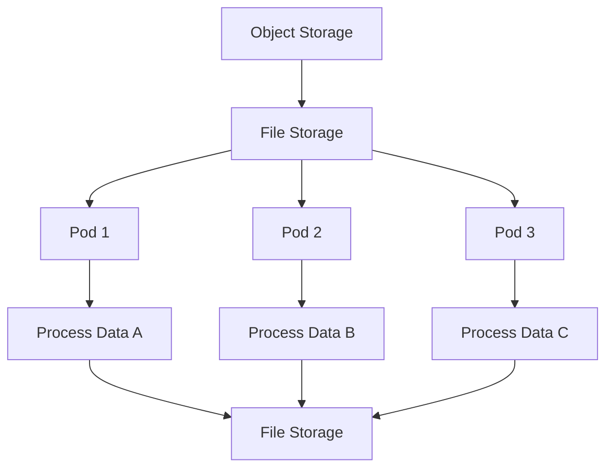
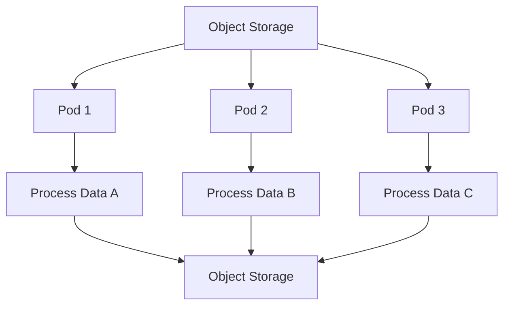

# Using Storage
TIDE storage types can be used in a composable manner to achieve different purposes throughout the data lifecycle.
There is no one-size-fits-all approach to using TIDE's storage options, as storage needs may evolve over the course of a project.
Due to that flexibility, we will only consider a few recommended patterns.

This documentation serves as a high-level overview and does not dive into the technical details of implementing each workflow.
This documentation builds upon the [Storage Services](/storage-services/) overview, so we recommend becoming familiar with that content before continuing.
This documentation is structured so that simpler storage solutions are presented first, with more advanced solutions building on previous examples.

## JupyterHub Storage Workflows
Most users may first interact with TIDE through our [JupyterHub](/jupyterhub) service.
JupyterHub increases access to TIDE's advanced hardware by providing a user friendly graphical user interface (GUI) available on the web.
This section will consider storage workflows in the context of JupyterHub.

### Block Storage
The TIDE JupyterHub instance provides home directory storage that is backed by block storage.
This is a good choice for single-user workflows that need persistence and low-latency disk operations.
In this workflow, you would upload data from a local computer through the JupyterLab GUI or transferred from the internet using command line tools like `wget`, `curl` or `git` from the integrated terminal

Workflow steps:
1. Upload data to block storage
1. Process data
1. Data is saved on block storage

Workflow diagram:

### Block Storage and Object Storage
The previous example may work for a lot of projects, but there are cases where this approach begins to hit a scaling problem.
Sometimes the total amount of data that needs to be processed or generated exceeds the available block storage capacity.
For example, given a block storage allocation of 50 GB it would not be feasible to process 200 GB of data at once.
When this happens, we recommend using object storage to transfer data in and out of block storage in batches.
This approach solves the scaling problem, but introduces network data transfers and requires more planning for the data lifecycle of a project.
- *Note*: This workflow may require learning additional tools that are compatible with the S3 API such as Rclone, AWS CLI or Boto3.

Workflow steps:
1. Store the full dataset in object storage
2. Transfer smaller batches of data to block storage for processing
3. Transfer the processed data back to object storage
4. Remove processed data from block storage

Workflow diagram:

## Batch Job Storage Workflows
This section will consider storage workflows in the context of [batch jobs](/batch-jobs/).
Batch jobs allow for longer running jobs, running multiple jobs at a time and running distributed jobs.
We recommend becoming familiar with the batch job overview content before continuing.

### Block Storage
Block storage can be used in the context of batch jobs, which are useful for long-running computations.
Block storage is a "ReadWriteOnce" storage type, so each pod will require its own dedicated block storage.
This might be fine for running multiple independent workflows, but we generally do not recommend this approach for distributed or parallel workflows.

This approach will generally involve transferring data to block storage via command line tools like `wget`, `curl` or `git`.
Data transfer can be done via interactive jobs or as part of the batch job via automated scripts.
Aside from that, this approach is very similar to block storage use on JupyterHub.

Workflow steps:
1. Upload data to block storage
1. Process data
1. Data is saved on block storage

Workflow diagram:

### Object Storage and File Storage
Some projects may benefit from distributed data processing with batch jobs.
When distributing data, you will need a way to partition or split your data into batches.
A simple example would be creating folders of data and passing one folder of data to each pod.
We recommend storing and organizing the complete dataset in object storage.
You would then manually transfer the dataset to file storage before scheduling a distributed batch job.
Since file storage is a "ReadWriteMany" storage type, there is a single copy of the data accessed from multiple pods simultaneously.

Workflow steps:
1. Upload full dataset to object storage
1. Transfer data to file storage
1. Pass partitioned data to each pod
1. Process partitioned data in each pod
1. Data is saved by each pod on same file storage

Workflow diagram:

- *Note*: The last instance of "File Storage" is just for convenience of visualization and does not imply an additional data tranfer

### Object Storage and Ephemeral Storage
This last workflow is the most advanced and the most scalable.
This approach relies on network file transfers which may increase latency depending on the size of the data.
This approach uses ephemeral storage which is physically located on the same node as the pod.

Workflow steps:
1. Upload full dataset to object storage
1. Transfer data to ephemeral storage in each pod
1. Process partitioned data in each pod
1. Upload processed data from each pod to object storage

Workflow diagram:

